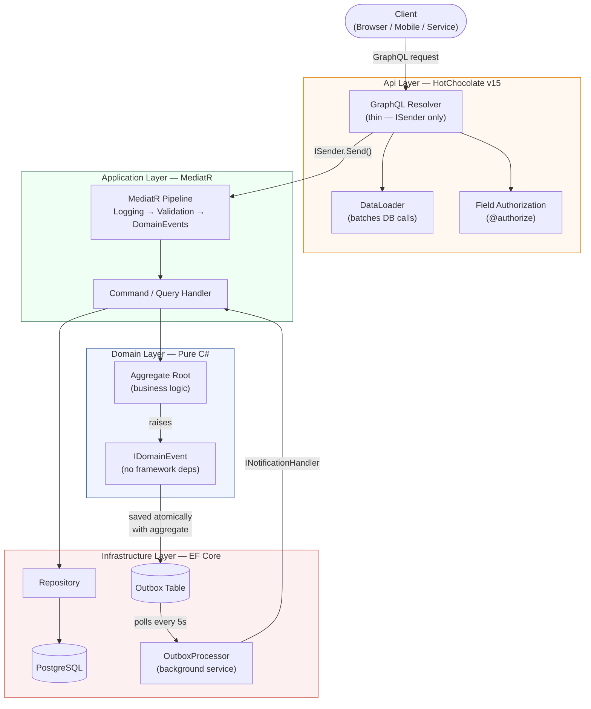
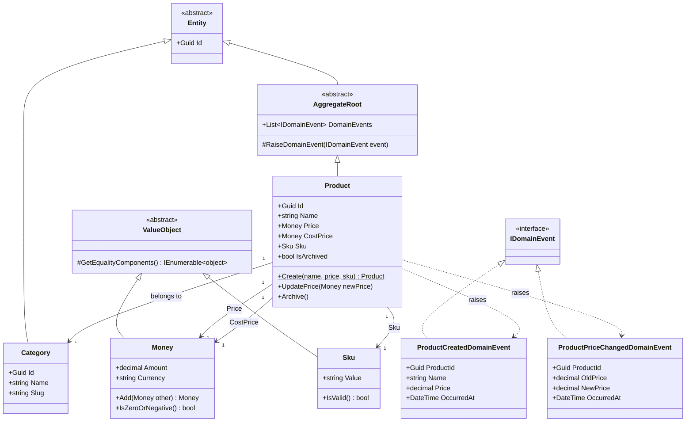

# Architecture

The repository follows a layered structure:

- `Domain`: pure business model and domain events — zero external dependencies
- `Application`: commands, queries, validators, mappings, and MediatR behaviors
- `Infrastructure`: EF Core, repositories, outbox persistence, and background processing
- `Api`: HotChocolate v15 schema and thin resolvers

## System Diagram

## Domain Model

## Request Flow

See [request-flow.md](request-flow.md) for the full sequence diagram showing the lifecycle of a `createProduct` mutation from client through outbox processor.

## Key Decisions

| Decision | ADR |
|---|---|
| Domain events don't implement `INotification` | [ADR-001](decisions/ADR-001-domain-events-not-mediatr.md) |
| Outbox pattern over direct event publishing | [ADR-002](decisions/ADR-002-outbox-over-direct-publish.md) |
| Thin GraphQL resolvers as delivery adapters | [ADR-003](decisions/ADR-003-thin-graphql-resolvers.md) |
