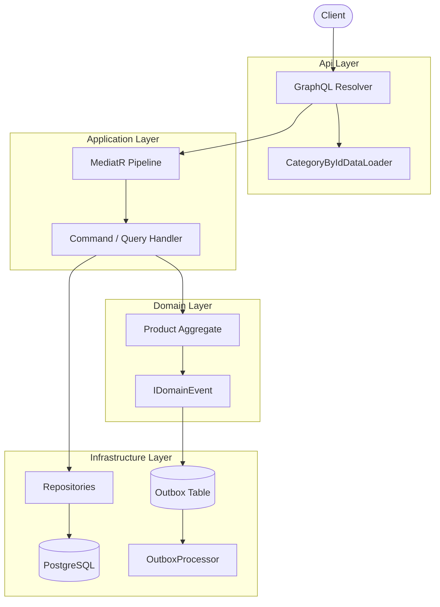
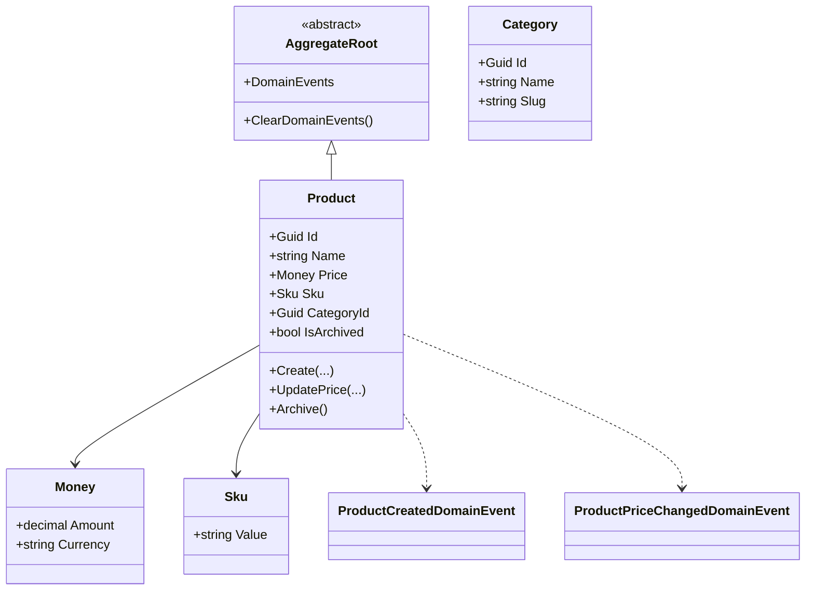

# Architecture

The repository follows a layered structure:

- `Domain`: pure business model and domain events
- `Application`: commands, queries, validators, mappings, and MediatR behaviors
- `Infrastructure`: EF Core, repositories, outbox persistence, and background processing
- `Api`: HotChocolate schema and thin resolvers

## System Diagram

## Domain Model

