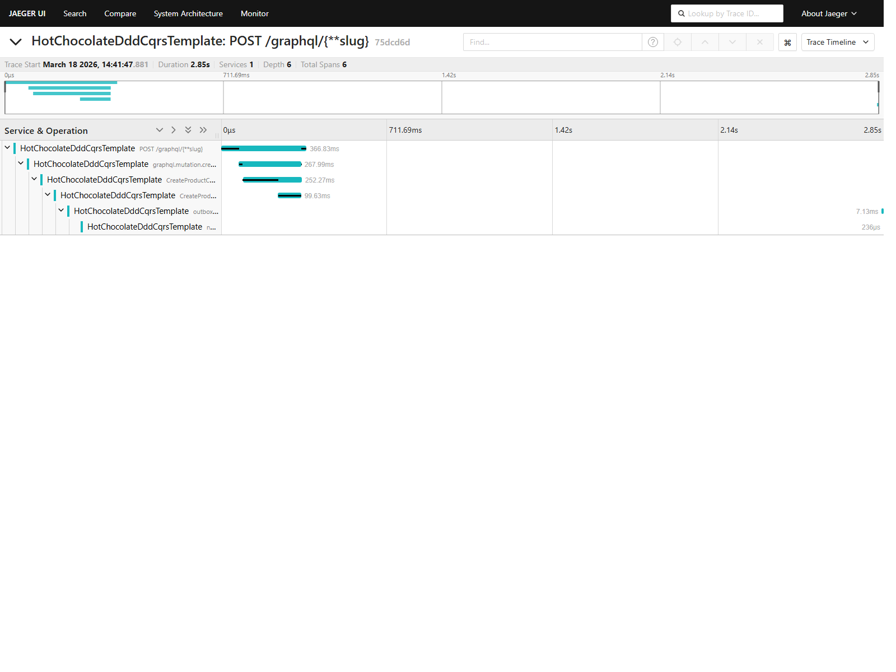

# Observability

The template exports traces to Jaeger through OTLP when `OpenTelemetry:Enabled` is `true`.

## Instrumented spans

- ASP.NET Core request span for `/graphql`
- GraphQL resolver spans in query and mutation roots
- MediatR request handling spans
- Outbox persistence span after command handling
- Outbox polling and message-processing spans
- Notification handler spans after outbox dispatch

## Local setup

```bash
docker compose up --build -d
```

Open Jaeger at [http://localhost:16686](http://localhost:16686).

The Compose stack exports OTLP traces to Jaeger and seeds local sample data automatically in Development.
The local PostgreSQL container is exposed on `localhost:55432`.

## Expected trace shape

```text
HTTP POST /graphql
  -> graphql.mutation.createProduct
    -> CreateProductCommand.handle
      -> CreateProductCommand.persist_outbox
  -> outbox.poll
    -> outbox.process_message
      -> notification.product_created
```

## Screenshot

Regenerate the checked-in screenshot with:

```powershell
./scripts/capture-jaeger-trace.ps1
```

The script starts the local Docker stack, drives a traced GraphQL mutation, writes `docs/assets/jaeger-trace.png`, and tears the local services back down when it finishes.


