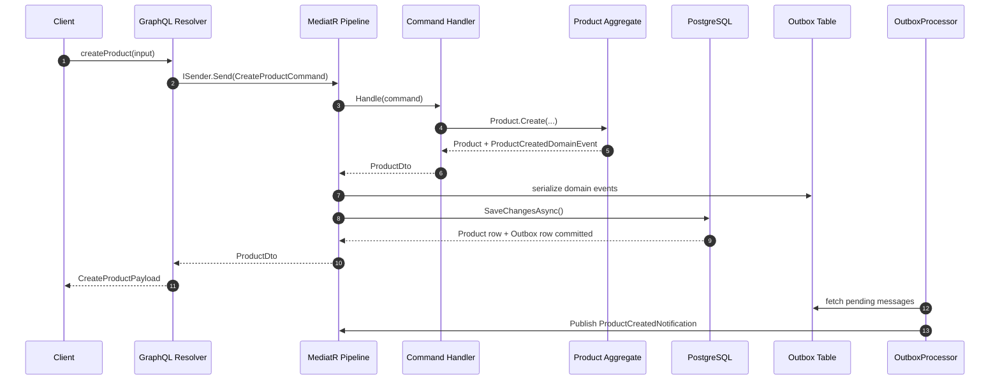

# Request Flow

The `createProduct` mutation follows this sequence:

```mermaid
sequenceDiagram
    autonumber
    participant Client
    participant Resolver as GraphQL Resolver
    participant Pipeline as MediatR Pipeline
    participant Handler as Command Handler
    participant Aggregate as Product Aggregate
    participant DB as PostgreSQL
    participant Outbox as Outbox Table
    participant Processor as OutboxProcessor

    Client->>Resolver: createProduct(input)
    Resolver->>Pipeline: ISender.Send(CreateProductCommand)
    Pipeline->>Handler: Handle(command)
    Handler->>Aggregate: Product.Create(...)
    Aggregate-->>Handler: Product + ProductCreatedDomainEvent
    Handler-->>Pipeline: ProductDto
    Pipeline->>Outbox: serialize domain events
    Pipeline->>DB: SaveChangesAsync()
    DB-->>Pipeline: Product row + Outbox row committed
    Pipeline-->>Resolver: ProductDto
    Resolver-->>Client: CreateProductPayload
    Processor->>Outbox: fetch pending messages
    Processor->>Pipeline: Publish ProductCreatedNotification
```
